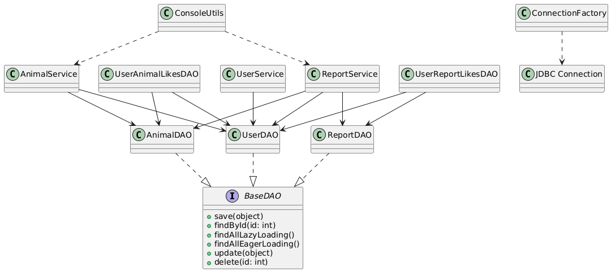

# Documento Técnico: Neighborhood Animal Tracker

## Descrição, Justificativas e Evidências

---

## 1. Descrição

O **Neighborhood Animal Tracker** é uma aplicação Java desenvolvida para o gerenciamento, monitoramento e interação com animais de bairro. O projeto emprega uma **arquitetura em camadas** (Model, DAO, Service, Utils) e utiliza um **banco de dados relacional (MySQL)** para persistência de dados.

### Visão Geral da Estrutura de Pacotes

* **`model`**: Contém as entidades centrais do domínio (`Animal` e suas subclasses especializadas `Cat`, `Dog`, `Capybara`; `User`, `Report`).
* **`dao`**: A camada de **Data Access Object (DAO)**, responsável por todas as operações **CRUD (Create, Read, Update, Delete)** e consultas complexas. Inclui `AnimalDAO`, `UserDAO`, `ReportDAO`, `UserAnimalLikesDAO`, `UserReportLikesDAO`, e uma `BaseDAO` fundamental.
* **`service`**: Implementa a **lógica de negócio** da aplicação (`AnimalService`, `UserService`, `ReportService`), orquestrando as interações com a camada DAO.
* **`enums`**: Define atributos fixos e enumeráveis como `Color`, `Size`, `TailLength` e `StreetName` para representação consistente dos dados.
* **`interfaces`**: Contém a interface `Likeable`, que indica entidades que podem receber "curtidas".
* **`util`**: Fornece classes utilitárias, especificamente `ConnectionFactory` para **gerenciamento de conexões JDBC** e `ConsoleUtils` para interações via **interface de linha de comando (CLI)**.

### Diagrama de Classes (Model/Enums)

### Diagrama de Classes (Camada DAO/Service/Utils)

---

## 2. Justificativas

As escolhas arquiteturais para o Neighborhood Animal Tracker são guiadas pelos princípios de **boas práticas de engenharia de software**, garantindo uma aplicação robusta, de fácil manutenção e escalável:

* **Clara Separação de Preocupações**: Cada camada recebe uma responsabilidade distinta e bem definida:
    * **`Model`**: Representa puramente o domínio de negócio, contendo dados e comportamentos básicos.
    * **`DAO`**: Abstrai as interações com o banco de dados, isolando as consultas SQL e especificidades JDBC da lógica de negócio.
    * **`Service`**: Encapsula regras de negócio complexas, gerenciamento transacional e coordena o fluxo de dados entre os DAOs e a camada de UI/apresentação.
    * **`Util`**: Fornece funções auxiliares que não se encaixam na lógica de negócio central ou no acesso a dados.

* **Promove Reutilização e Extensibilidade**: A adoção de uma interface `BaseDAO` genérica estabelece um contrato consistente para operações comuns de banco de dados (CRUD). Esse padrão permite a fácil criação de novos DAOs, mantendo uma API previsível, reduzindo significativamente o código repetitivo e simplificando futuras extensões.

* **Aprimora a Manutenibilidade e Testabilidade**: A arquitetura modular e com baixo acoplamento torna o sistema mais fácil de manter. Dependências explícitas e bem definidas entre as classes facilitam o **teste de unidade** e o **teste de integração**, pois componentes individuais podem ser testados isoladamente ou em cenários controlados.

* **Aderência a Padrões da Indústria e Boas Práticas**:
    * **Enums**: Utilizados para conjuntos fixos de valores (ex: `Color`, `Size`), melhorando a segurança de tipo e a legibilidade.
    * **Interfaces**: A interface `Likeable` impõe um comportamento comum a diferentes tipos de entidades, promovendo o polimorfismo.
    * **`ConnectionFactory`**: Centraliza o gerenciamento de conexões de banco de dados, garantindo configuração consistente, tratamento de recursos e erros, e prevenindo vazamentos de conexão.

---

## 3. Evidências da Implementação

O design arquitetural não é meramente teórico, mas está tangivelmente refletido na base de código do projeto:

* **Implementações DAO Abrangentes**: As classes dentro do pacote `dao` implementam integralmente as operações CRUD, gerenciam relacionamentos com o banco de dados (ex: `UserAnimalLikesDAO`, `UserReportLikesDAO`) e realizam recuperação complexa de dados, demonstrando persistência robusta.
* **Orquestração da Camada de Serviço**: As classes `service` orquestram ativamente as operações, garantindo a integridade e atomicidade dos dados através de transações JDBC quando necessário, refletindo uma verdadeira camada de lógica de negócio.
* **Modelo de Domínio Rico**: O pacote `model` reflete com precisão o domínio do problema, utilizando **herança** para subtipos de `Animal` (`Cat`, `Dog`, `Capybara`) e **composição** para relacionamentos (ex: um `Report` tendo um `User` e um `Animal`), demonstrando princípios sólidos de POO.
* **Abstração Comportamental**: A interface `Likeable` e o uso de enums são aplicados consistentemente em todas as entidades relevantes, fornecendo exemplos concretos de comportamento polimórfico e dados estruturados.
* **Exemplos de Código Demonstrando Comunicação Inter-camadas**:
    * `AnimalService.userLikesAnimal(int userId, int animalId)`: Ilustra como a camada de serviço processa uma operação de negócio, coordena com os DAOs (ex: `UserAnimalLikesDAO`) e atualiza o estado da aplicação e do banco de dados.
    * `ReportService.createReport(Report report)`: Mostra a integridade transacional em ação, garantindo que a criação de um novo relatório seja atômica.
    * `ConsoleUtils.displayTopAnimals(AnimalService)`: Um exemplo claro da camada `util` interagindo com a camada `service` para apresentar dados de negócio ao usuário.
    * `ConsoleUtils.deleteAllEntries(UserDAO, AnimalDAO, ReportDAO)`: Evidencia uma função utilitária interagindo diretamente com múltiplos DAOs para realizar um reset completo do banco de dados.
* **Correlação com o Diagrama UML**: O **diagrama de classes UML** fornecido reflete com precisão a estrutura real do projeto, descrevendo claramente os relacionamentos e responsabilidades entre as camadas DAO, Service e Utils, validando as afirmações arquiteturais.
* **Gerenciamento Centralizado de Conexões**: O uso consistente de `ConnectionFactory` em toda a aplicação para obter e fechar conexões de banco de dados confirma a aderência ao gerenciamento centralizado de recursos e simplifica o tratamento de erros.

---

**Conclusão:**

A arquitetura do Neighborhood Animal Tracker adere rigorosamente aos princípios modernos de design orientado a objetos e às melhores práticas estabelecidas de engenharia de software. A estrutura modular e em camadas, combinada com responsabilidades claras e implementações robustas em todas as camadas Model, DAO, Service e Utility, garante uma aplicação altamente manutenível, testável e extensível. A base de código fornecida e os diagramas de apoio servem como forte evidência dessa integridade arquitetural e prontidão para futuras evoluções.
